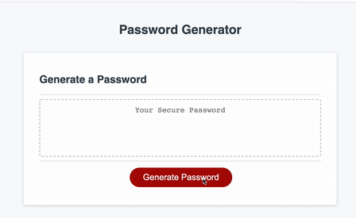

# Password_Generator

Explore the [Project Page](https://github.com/jesshuang7/Password_Generator)

View the [Github-pages](https://jesshuang7.github.io/Password_Generator/)

## Table of Contents

* [About the Project](#about-the-project)
  * [HTML](#html)
  * [Assets](#Assets)
  * [Built With](#built-with)
* [Getting Started](#getting-started)
  * [Prerequisites](#prerequisites)
  * [Installation](#installation)
* [Roadmap](#roadmap)
* [Contributing](#contributing)
* [License](#License)
* [Contact](#contact)
* [Acknowledgements](#acknowledgements)

## About the Project:
The focus of this project was to create an application that generates a random password based on user-selected criteria. The password must be between 8-128 characters and must include at least one chractert type -- lower/upper case letters, numbers, or special characters. This app will run in the browser and feature dynamically updated HTML and CSS powered by the JavaScript code. It will also feature a clean and polished user interface and be responsive, ensuring that it adapts to multiple screen sizes.



### HTML:
* [index.html](https://github.com/jesshuang7/Password_Generator/blob/master/index.html)

### Assets:
* [style.css](hhttps://github.com/jesshuang7/Password_Generator/blob/master/Assets/style.css)

### Built With:
* This app is build upon JavaScript. 

## Getting Started:
To get a local copy up and running follow the steps below.

### Prerequisites:
None.

### Installation:
1. Clone the Repository:
```sh
git clone git@github.com:jesshuang7/Password_Generator.git
```

## Roadmap:
Currently no known issues, but track track [open issues](https://github.com/jesshuang7/Password_Generator/issues ) for proposed features (and known issues) in the future.


## Contributing:
Any contributions you make are **greatly appreciated**.

1. Fork the Project
2. Create your Feature Branch (`git checkout -b feature/AmazingFeature`)
3. Commit your Changes (`git commit -m 'Add some AmazingFeature'`)
4. Push to the Branch (`git push origin feature/AmazingFeature`)
5. Open a Pull Request

## License:

MIT License

Copyright (c) [2020] [Jessica Huang]

Permission is hereby granted, free of charge, to any person obtaining a copy
of this software and associated documentation files (the "Software"), to deal
in the Software without restriction, including without limitation the rights
to use, copy, modify, merge, publish, distribute, sublicense, and/or sell
copies of the Software, and to permit persons to whom the Software is
furnished to do so, subject to the following conditions:

The above copyright notice and this permission notice shall be included in all
copies or substantial portions of the Software.

THE SOFTWARE IS PROVIDED "AS IS", WITHOUT WARRANTY OF ANY KIND, EXPRESS OR
IMPLIED, INCLUDING BUT NOT LIMITED TO THE WARRANTIES OF MERCHANTABILITY,
FITNESS FOR A PARTICULAR PURPOSE AND NONINFRINGEMENT. IN NO EVENT SHALL THE
AUTHORS OR COPYRIGHT HOLDERS BE LIABLE FOR ANY CLAIM, DAMAGES OR OTHER
LIABILITY, WHETHER IN AN ACTION OF CONTRACT, TORT OR OTHERWISE, ARISING FROM,
OUT OF OR IN CONNECTION WITH THE SOFTWARE OR THE USE OR OTHER DEALINGS IN THE
SOFTWARE.

## Contact:
Jessica Huang - tzunuhuang@gmail.com

Project Link: [https://github.com/jesshuang7/Password_Generator](https://github.com/jesshuang7/Password_Generator)

## Acknowledgements: 
* University of Washington Coding Bootcamp for providing me with the skills and knowledge to create this project. 
